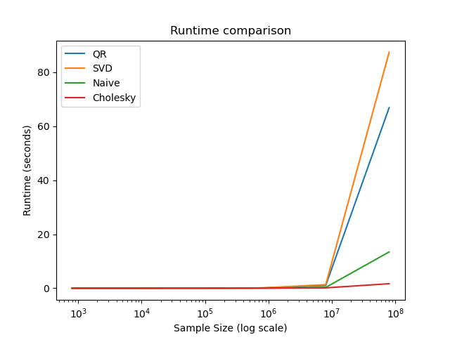

  CSE 790 - Assignment 2

 

  Pedram Pasandide - 400417813

 
 
 
 

**Question 1 **

Linear regression is a popular statistical method for modeling the relationship between a dependent variable $(y)$ and one
or more independent variables $(X)$. The goal of linear regression is to find the values of the coefficients $(\beta)$ that 
minimize the sum of the squared differences between the observed $y$ values and the predicted $y$ values.

The equation for linear regression is:

$$y = \beta _0 + \beta _1 × X_1 + \beta _2 × X_2 + ... + \beta _p × X_p$$

where $\beta _0, \beta _1, \beta _2, ..., \beta _p$ are the coefficients, $X_1, X_2, ..., X_p$ are the independent variables, and $p$ is the number of independent variables.

**a. Naive Linear Algebra **

To find the coefficients using linear algebra, we can rewrite the above equation in matrix form as:

$y = X × \beta$

where $X$ is a $(n × p+1)$ matrix, where n is the number of observations, $p$ is the number of independent variables, and the first column of $X$ consists of ones to account for the intercept $(\beta_ 0)$. $\beta$ is a $(p+1 × 1)$ column vector that contains the coefficients.

To find the values of beta that minimize the sum of squared differences, we need to solve the following equation:

$$X^T × X × \beta = X^T × y$$

where $X^T$ is the transpose of X.

We can solve for beta by multiplying both sides by the inverse of $X^T × X$:

$$\beta = (X^T × X)^{-1} × X^T × y$$

Note that the inverse of $X^T×X$ exists only if $X^T×X$ is invertible, which is guaranteed if $X$ has full rank (i.e., if the number of observations is greater than or equal to the number of independent variables).

**a. QR decomposition **

QR decomposition is a factorization of a matrix into an orthogonal matrix and an upper triangular matrix.

To use QR decomposition for linear regression, we first perform QR decomposition on the matrix $X$:

$$X = QR$$

where $Q$ is an orthogonal matrix and $R$ is an upper triangular matrix.

Next, we substitute the QR decomposition into the equation:

$$X^T × X × \beta = X^T × y$$

$$X^T × X × \beta = Q × R × \beta = Q × (R × \beta)$$

$$X^T × y = Q^T × Q × R × \beta = R × \beta$$

Now, we can solve for $\beta$ by using back substitution, since R is upper triangular:

$$\beta = R^{-1} × Q^T × y$$

Note that $R$ is always invertible, because it is an upper triangular matrix. Also, since $Q$ is orthogonal, $Q^T × Q = I$, where $I$ is the identity matrix.

**a. SVD **

SVD is a factorization of a matrix into the product of three matrices: a unitary matrix, a diagonal matrix, and the conjugate transpose of a unitary matrix.

To use SVD for linear regression, we first perform SVD on the matrix $X$:

$$X = U × S × V^H$$

where $U$ is a unitary matrix, $S$ is a diagonal matrix containing the singular values, and $V^H$ is the conjugate transpose of a unitary matrix.

Next, we substitute the SVD decomposition into the equation:

$$X^T × X × beta = X^T × y$$

$$X^T × X × beta = V × S^T × U^T × U × S × V^H × beta = V × S^T × S × V^H × beta = V × V^H × beta$$

$$X^T × y = V × S^T × U^T × y$$

Now, we can solve for beta by using back substitution, since $V$ is unitary:

$$\beta = V × V^H × X^T × y = V × (S^T)^-1 × U^T × y$$

Note that since $S$ is diagonal, $(S^T)^{-1}$ is the inverse of $S$, which is easily computed by taking the reciprocal of the non-zero elements of $S$.

**a. Cholesky Decomposition **

Cholesky decomposition is a factorization of a symmetric, positive-definite matrix into the product of $a$ lower triangular matrix and its transpose.

To use Cholesky decomposition for linear regression, we first perform Cholesky decomposition on the matrix $X^T × X$:

$$X^T × X = L × L^T$$

where $L$ is a lower triangular matrix.

Next, we substitute the Cholesky decomposition into the equation:

$$X^T × X × \beta = X^T × y$$

$$L × L^T × \beta = X^T × y$$

Now, we can solve for beta by using forward substitution and back substitution, since L is lower triangular:

$$L × z = X^T × y$$

$$L^T × \beta = z$$

Note that the matrix $X^T × X$ must be positive-definite for the Cholesky decomposition to be possible. If $X^T × X$ is not positive-definite, then you would need to use a different method such as QR decomposition or singular value decomposition to solve for the linear regression coefficients.

**b. **

The sample size has increased from 1000 to 100000000. The MSE is calculated using test data which is 20% of the whole dataset. The code can be found in `PasandidePedram_HW2_Q1.py` A runtime comparison is shown by the following figure.

**c. **

The time complexity of the SVD and QR decomposition methods for linear regression is higher than the time complexity of the Naive or Cholesky methods because of the mathematical operations involved in each method. SVD and QR decomposition are more computationally intensive methods as they require decomposing a matrix into its singular values or eigenvectors, respectively. On the other hand, Naive and Cholesky methods only require solving a system of linear equations, which is computationally less intensive. When the sample size increases, the size of the matrix that needs to be decomposed in SVD and QR methods also increases, resulting in a higher runtime. In contrast, the runtime for Naive and Cholesky methods remains relatively constant, even as the sample size increases. This is why these methods are often favored when working with large datasets.
 
 

**Question 2 **

The code can be found in `PasandidePedram_HW2_Q2.py`. The Ridge Regression is shown in the following equation 
$$MSE = 1/N Σ_{i=1}^N (y_i - ŷ_i)^2 + λ Σ_{j=1}^p β_j^2$$

Where in the code $λ=10$. It means when We fit a Ridge regression model on the augmented data the regularization parameter (alpha) is 10.

We then perform data augmentation by adding Gaussian noise to the training data. Specifically, we add 50 noisy copies of each training point, with the noise added according to a normal distribution with mean 0 and standard deviation 0.5.

Finally, we evaluate the performance of the model on the test set by computing the mean squared error (MSE) between the predicted and actual values of the target variable.

| Model | Data Augmentation | MSE on Test Set |
|-------|------------------|-----------------|
| Ridge Regression | Yes | 0.4911 |
| Ridge Regression | No | 0.4877 |
| Linear Regression | Yes | 0.4911 |
| Linear Regression | No | 0.5213 |

 
 

**Question 3 (3.6 from ESL) **

Under the Bayesian perspective, ridge regression can be formulated as a maximum a posteriori (MAP) estimation problem, where the regularization term serves as a Gaussian prior on the regression coefficients β.

Specifically, the ridge regression objective function can be written as:

$$\hat{\beta}^{ridge} = \underset{\beta}{\operatorname{argmin}} ||y - X\beta||^2_2 + \lambda ||\beta||^2_2$$

which is equivalent to the negative log posterior distribution:

$$-log p(\beta|y,X) \propto ||y - X\beta||^2_2 + \frac{1}{2\tau}||\beta||^2_2$$

where $y$ is the target variable, $X$ is the design matrix, $\lambda$ is the regularization parameter, $\tau$ is the prior variance, and $\beta$ is the regression coefficient.

Since the sampling model $y ∼ N(Xβ, σ^2I)$ is also Gaussian, we can write the posterior distribution $p(\beta|y,X)$ as:

$$p(\beta|y,X) \propto p(y|X,\beta)p(\beta)$$

$$ \propto exp\left[-\frac{1}{2\sigma^2}||y - X\beta||^2_2\right]exp\left[-\frac{1}{2\tau}||\beta||^2_2\right]$$

$$ \propto exp\left[-\frac{1}{2\sigma^2}(\beta-\hat{\beta})^TX^TX(\beta-\hat{\beta})-\frac{1}{2\tau}\beta^T\beta\right]$$

where $\hat{\beta}=(X^TX+\frac{\sigma^2}{\tau}I)^{-1}X^Ty$ is the ridge regression estimate.

By completing the square, we can see that the posterior distribution is also Gaussian:

$$p(\beta|y,X) \propto exp\left[-\frac{1}{2}(\beta-\hat{\beta}{MAP})^T\Lambda(\beta-\hat{\beta}{MAP})\right]$$

where $\hat{\beta}_{MAP}$ is the ridge regression estimate, and $\Lambda=\frac{1}{\sigma^2}X^TX+\frac{1}{\tau}I$ is the precision matrix.

Therefore, the ridge regression estimate is the mean and mode of the posterior distribution, which is a Gaussian distribution with mean $\hat{\beta}_{MAP}$ and covariance matrix $\sigma^2\Lambda^{-1}$.

The relationship between the regularization parameter λ and the variances τ and σ2 can be derived from the precision matrix:

$$\Lambda = \frac{1}{\sigma^2}X^TX+\frac{1}{\tau}I = \frac{1}{\sigma^2}(X^TX+\frac{\sigma^2}{\tau}I)$$

Comparing with the ridge regression formula, we can see that $\lambda=\frac{\sigma^2}{\tau}$.

Therefore, the regularization parameter λ controls the ratio between the variances of the prior distribution and the sampling noise, and a larger λ corresponds to a stronger regularization and a more shrinkage of the coefficients towards zero.

 
 

**Question 4 (3.19 from ESL) **

For ridge regression, the solution for the coefficients is given by:

$$\hat{\beta}^{ridge} = (X^TX + \lambda I)^{-1}X^Ty$$

where $\lambda$ is the tuning parameter, $I$ is the identity matrix, and $X$ and $y$ are the design matrix and response variable, respectively.

The norm of the coefficients can be calculated as:

$$||\hat{\beta}^{ridge}|| = \sqrt{\sum_{j=1}^p \hat{\beta}_j^{2}}$$

As $\lambda$ approaches zero, the regularization term $ \lambda I$ approaches zero, and the solution converges to the ordinary least squares solution. Therefore, as $\lambda$ approaches zero, the values of $\hat{\beta}^{ridge}$ will become larger, which will result in an increase in the norm of the coefficients, $||\hat{\beta}^{ridge}||$.

For the Lasso, as the tuning parameter $\lambda$ decreases, more coefficients are allowed to be non-zero, and the magnitudes of the non-zero coefficients may increase, resulting in an increase in $||\hat{\beta}^{lasso}||$.

For Partial Least Squares (PLS), the "tuning parameter" is not a single value, but rather a sequence of steps in the algorithm. As the number of steps increases, the algorithm identifies more components, and the values of the coefficients may increase, resulting in an increase in the norm of the coefficients, $||\hat{\beta}^{PLS}||$. However, the exact behavior of $||\hat{\beta}^{PLS}||$ with respect to the number of steps and the data depends on the specific implementation of the algorithm.

 
 

**Question 5 (3.28 from ESL) **

The Lasso formulation is subject to
$\sum_{j=1}^p |\beta _j|≤ t$

Suppose for a given t, the fitted lasso coefficient for
variable $X_j$ is $\hat{\beta}_{j} = a$. Suppose we augment our set of variables with an identical copy $X^{∗}_{j} = X_j$. 

In the presence of exact collinearity between variables, the Lasso penalty cannot distinguish between the two identical variables, and the solution for the coefficients can be unstable and depend on the specific optimization algorithm used. In this case, the set of possible solutions for the Lasso coefficients $\hat{\beta}_{j}$ and $\hat{\beta}^{*}_{j}$ is infinite and can depend on the specific optimization algorithm and numerical precision used.

However, in general, the Lasso penalty tends to distribute the coefficients among the collinear variables as evenly as possible, so it is likely that the solutions will be spread out between $\hat{\beta}{j}$ and $\hat{\beta}^{*}_{j}$, but their sum is fixed at $2a$. More specifically, since the Lasso penalty promotes sparsity, it is possible that only one of the two collinear variables is selected (i.e., one of $\hat{\beta}_{j}$ or $\hat{\beta}^{*}_{j}$ is non-zero), and the other variable's coefficient is shrunk towards zero. Alternatively, both $\hat{\beta}_{j}$ and $\hat{\beta}^{*}_{j}$ may be non-zero, but with values that add up to $2a$

 
 

**Question 6 (3.30 from ESL) **

Consider the elastic-net optimization problem:

$\underset{\beta}{min} ||y − Xβ||^2 + λ[\alpha||\beta||^{2}_{2} + (1-\alpha)||\beta||_1 ]$

Show how one can turn this into a lasso problem, using an augmented version of X and y.

To turn the elastic-net optimization problem into a lasso problem, we can use an augmented version of X and y. Let $\tilde{X}$ and $\tilde{y}$ be the augmented versions of X and y, defined as follows:

$$\tilde{X} = \begin{bmatrix} X \ \sqrt{\lambda\alpha}I_p \end{bmatrix}$$

and

$$\tilde{y} = \begin{bmatrix} y \ 0_p \end{bmatrix}$$

where $I_p$ is the p-dimensional identity matrix and $0_p$ is a p-dimensional zero vector. Here, we add p rows to X, each of which contains a single non-zero element equal to $\sqrt{\lambda\alpha}$ and zeros elsewhere, and we add p zeros to y.

Now, we can rewrite the elastic-net optimization problem in terms of $\tilde{X}$ and $\tilde{y}$ as:

$$\underset{\beta}{min} ||\tilde{y} - \tilde{X}\beta||^2 + \lambda(1-\alpha) ||\beta||_1$$

This is a lasso problem with the same solution as the original elastic-net problem. By adding the rows to $\tilde{X}$, we make sure that the L2 penalty only applies to the original features in X, not to the added rows. The L1 penalty applies to all the features, including the added rows, but since they have no corresponding values in $\tilde{y}$, they do not affect the solution of the problem. Therefore, solving this lasso problem gives the same solution as the original elastic-net problem with the same value of $\lambda$ and $\alpha$.