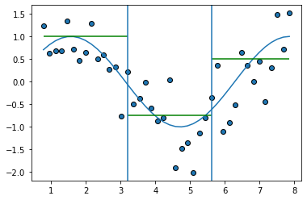
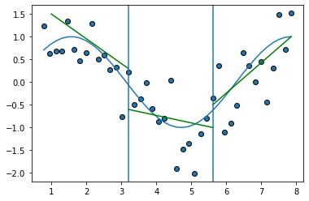
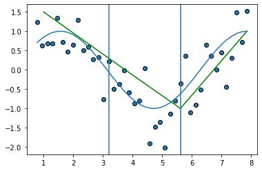
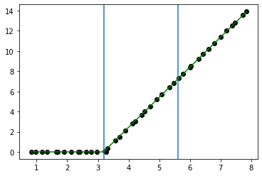
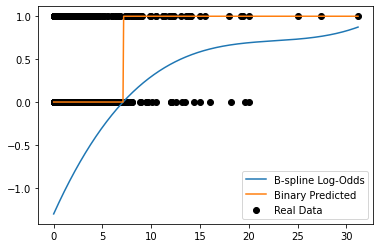
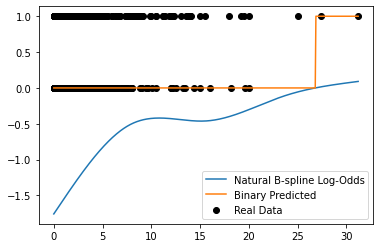
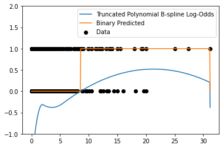

  CSE 790 - Assignment 3

 

  Pedram Pasandide - 400417813

 
 
 
 

**Question 1 **

**Replicate a figure from ESL chapter 5:**

The code is `in PedramPasandide_HW3_Q1.ipynb`.

 
 

**Question 2 **

The code is `in PedramPasandide_HW3_Q2.ipynb`. The details have been mentioned through the code.

 
 

**Question 3 **

Not Solved.

 
 

**Question 4 **

**Exercise 5.4 from ESL:** 

**Solution:** To prove that the natural boundary conditions for natural cubic splines imply the linear constraints on the coefficients, we need to use the following facts:

1. The natural boundary conditions for cubic splines require that the second derivatives at the endpoints be zero.

2. The second derivative of $f(X)$ is a piecewise linear function, with linear segments between each pair of adjacent knots.

Using these facts, we can derive the following expressions for the second derivatives of $f(X)$ at the endpoints:

$$f''(\xi_{1}) = 2\theta_{1}$$

$$f''(\xi_{K+1}) = 2\theta_{K}$$

Since we require $f''(\xi_{1})=0$ and $f''(\xi_{K+1})=0$ (natural boundary conditions), we get:

$$\theta_{1} = 0, \theta_{K} = 0$$

Also, since the second derivative of $f(X)$ is a piecewise linear function, the coefficients of $X$ and $X^2$ must be zero in each segment (between two adjacent knots). Therefore, we get:

$$\beta_{2} = 0, \beta_{3} = 0$$

Now, we can use the above results to derive the linear constraints:

$$\sum_{k=1}^{K}\theta_{k} = \theta_{1} + \sum_{k=2}^{K-1}\theta_{k} + \theta_{K} = 0$$

$$\sum_{k=1}^{K}\xi_{k}\theta_{k} = \xi_{1}\theta_{1} + \sum_{k=2}^{K-1}\xi_{k}\theta_{k} + \xi_{K}\theta_{K} = 0$$

To derive the basis functions, we first define:

$$d_{k}(X) = \frac{(X-\xi_{k}){+}^{3}-(X-\xi_{K}){+}^{3}}{\xi_{K}-\xi_{k}}$$

Note that $d_{k}(X)$ is a cubic polynomial that is zero outside the interval $[\xi_{k}, \xi_{K}]$. Also, $d_{k}(X)$ is a piecewise linear function with linear segments between each pair of adjacent knots, and has zero second and third derivatives for $X≥\xi_{K}$.

Now, we define the basis functions as follows:

$$N_{1}(X) = 1$$

$$N_{2}(X) = X$$

$$N_{k+2}(X) = d_{k}(X) - d_{K-1}(X),\ \ k=1,\dots,K-1$$

Note that $N_{k+2}(X)$ is a cubic polynomial that is zero outside the interval $[\xi_{k}, \xi_{K}]$. Also, $N_{k+2}(X)$ is a piecewise linear function with linear segments between each pair of adjacent knots, and has zero second and third derivatives for $X≥\xi_{K}$.

 
 

**Question 5 **

**Exercise 5.13 from ESL:** 

**Solution:** Adding a new point $(x_0,\hat{f}_{\lambda}(x_0))$ to the original sample will change the smoothing spline $\hat{f}_{\lambda}$ because it minimizes the sum of squared errors between the observed $y_i$ and the fitted function $\hat{f}_{\lambda}(x_i)$ for $i = 1,\dots,N$. Adding a new point will change the error at the point $x_0$ and also may affect the errors at other points. Therefore, refitting the smoothing spline on the augmented sample will result in a new estimate $\hat{f}_{\lambda}^{(1)}$ that is different from the original estimate $\hat{f}_{\lambda}$.

The N-fold cross-validation formula for the smoothing spline is derived by leaving out each data point in turn and refitting the smoothing spline on the remaining $N-1$ data points. Let $\hat{f}_{\lambda}^{(-i)}$ be the smoothing spline fit on the sample with the $i$th data point removed. Then the cross-validation estimate of the mean squared error is given by:

Recalling that the smoothing spline $$\hat{f}_{\lambda}$ is obtained by minimizing the following criterion:

$$\sum_{i=1}^{N}(y_i-f(x_i))^2+\lambda \int[f''(t)]^2dt$$

where $\lambda$ is a tuning parameter that controls the trade-off between the fit to the data and the smoothness of the function. The first term measures the fit to the data, and the second term measures the smoothness of the function.

Now, let $(-i)$ denote the set of indices ${1,\dots,N}$ with the $i$th index removed. We can obtain the estimate of $\hat{f}_{λ}^{(-i)}$ by minimizing the same criterion but using the data with the $i$th index removed:

$$\sum_{j\in(-i)}(y_j-f(x_j))^2+\lambda \int[f''(t)]^2dt$$

Let $\hat{f}_{\lambda}^{(-i)}(x)$ be the minimizer of this criterion. Then the cross-validation estimate of the mean squared error is given by:

$$CV(\hat{f}{\lambda}) = \frac{1}{N}\sum_{i=1}^{N}(y_i-\hat{f}_{\lambda}^{(-i)}(x_i))^2$$

This formula estimates the out-of-sample mean squared error of the smoothing spline. The cross-validation estimate is averaged over all $N$ data points, and for each data point, the smoothing spline is refit on the remaining $N-1$ data points. This procedure gives an estimate of how well the smoothing spline will generalize to new data. A smaller cross-validation estimate indicates a better fit to the data.
 